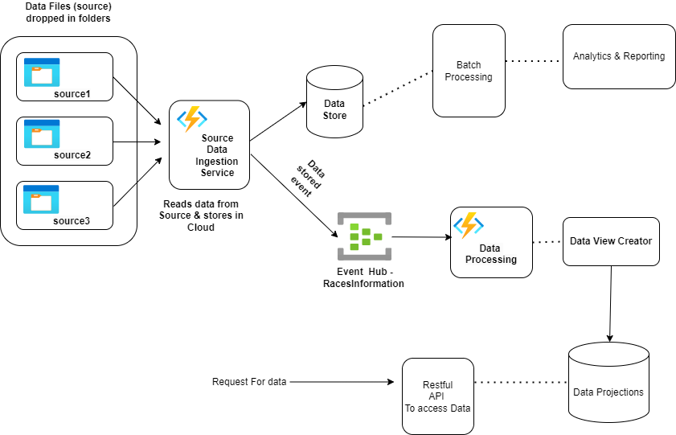
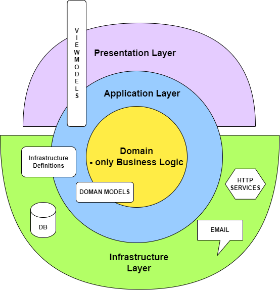

# About 

This is sample project to implement Big Data Architecture suggested in one of the Azure Architectural Design Types.

The application recieves horse racing data from various sources, "collects" it and outputs the horse names in price ascending order.

# System Design/Architecture 

# Code Organisation
This codebase is structured according to the Onion architecture pattern. In this architecture, layers are organized in a concentric manner, with the inner layers representing the core business logic and the outer layers handling peripheral concerns.

Presentation Layer: This layer is responsible for user interaction and interfaces with the application layer. It forwards requests from users to the application layer for processing and receives responses to be displayed to the user. All Functions form part of this layer. Data exchanged between the presentation layer and the application layer is encapsulated within view models. 

Application Layer: Often referred to as the "controller" or the "orchestrator," this layer coordinates the processing of entire requests. It serves as an intermediary between the presentation layer and other layers. All communication between layers is routed through the application layer.

Domain Layer: This layer encapsulates the core business logic and domain entities. When data needs to be processed according to business rules, the application layer invokes services provided by the domain layer. Data exchanged between the domain layer and the application layer is represented by domain models.

Infrastructure Layer: The infrastructure layer deals with interactions with external systems, databases, and peripherals. The application layer communicates with this layer when data requires interaction with external resources. Data passed between the infrastructure layer and the application layer is in the form of infrastructure definitions.

Below is a diagram illustrating the various layers of the architecture:
